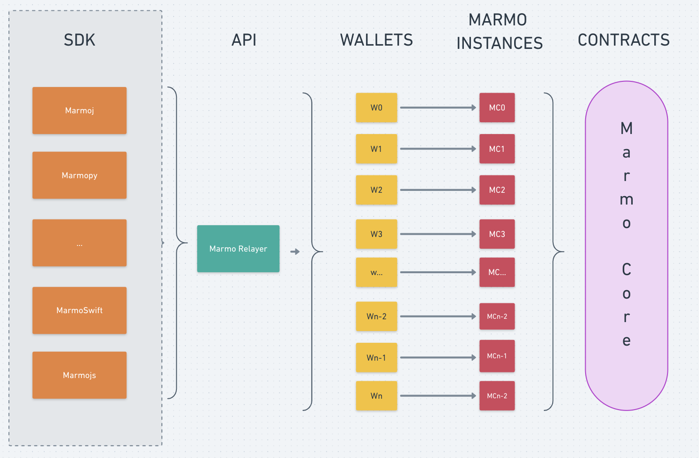
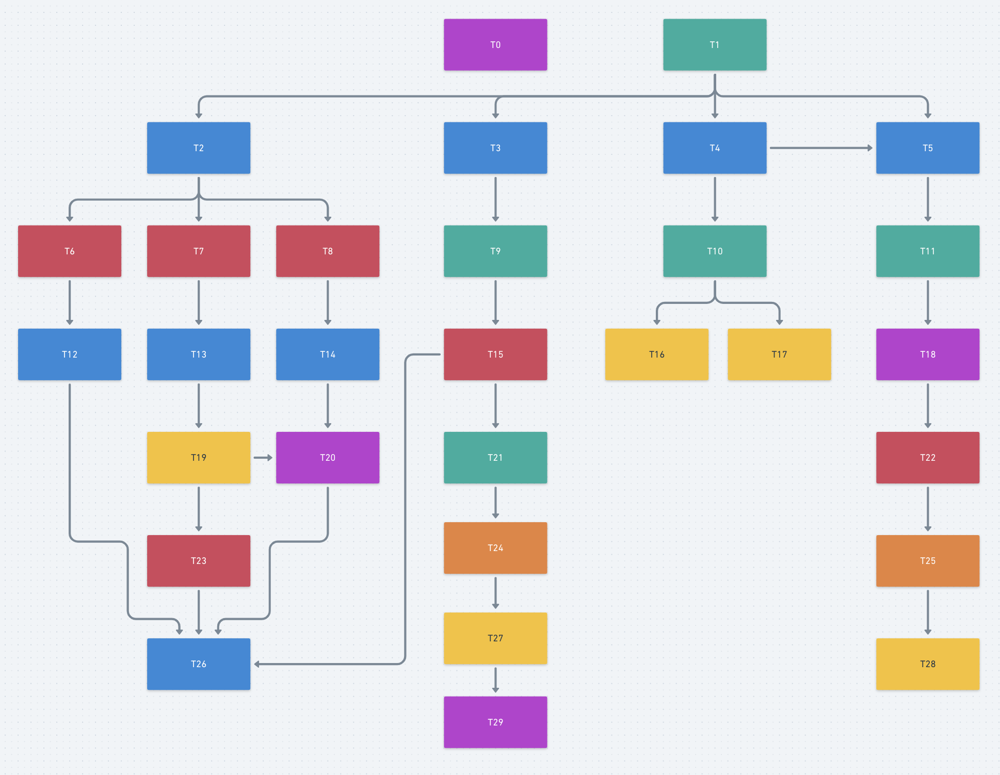

# Marmojs-sdk

# Description
Marmojs-sdk helps developers to consume Marmo Relayer.

# Simple Summary
Allowing users to sign messages to show intent of execution, but allowing a third party relayer to execute them is an emerging pattern being used in many projects. 
This pattern simplifies the integration with any Ethereum based platform. 
Marmo relayer: (https://github.com/ripio/marmo-relayer). 

# Abstract
### User pain points:
> - Users don't want to think about ether
> - Users want to be able to pay for transactions using whatever they have 
> - Users don’t want to download apps/extensions (at least on the desktop) to connect to their apps

# Ecosystem Graph


###### General WIKI ecosystem.
- Work in progress.
###### API layer
- Marmo relayer doc: (https://github.com/ripio/marmo-relayer/blob/master/README.md)
###### CORE layer
- Marmo contracts doc: (https://github.com/ripio/marmo-contracts/blob/master/README.md)

# Features
- Complete implementation of Intent functionality for Marmo relay.
- Ethereum wallet support.
- Comprehensive integration tests demonstrating a number of the above scenarios.

##### Runtime dependencies:

- Work in progress.

# Getting started

##### Prerequisites
* Work in progress.

#### Add the relevant dependency to your project:

##### NPM
- Work in progress.
   
# how it works?

### Intent Flowchart


###### Dependencies
> - T0  -> -
> - T1  -> - 
> - T2  -> T1
> - T3  -> T1
> - T4  -> T1
> - T5  -> T1, T4
> - T6  -> T2
> - T7  -> T2
> - T8  -> T2
> - T9  -> T3
> - T10 -> T4
> - T11 -> T5
> - T12 -> T6
> - T13 -> T7
> - T14 -> T8
> - T15 -> T9
> - T16 -> T10
> - T17 -> T10
> - T18 -> T11
> - T19 -> T13
> - T20 -> T14
> - T21 -> T15
> - T22 -> T18
> - T23 -> T19
> - T24 -> T21
> - T25 -> T22
> - T26 -> T12, T23, T20, T15
> - T27 -> T24
> - T28 -> T25
> - T29 -> T27


### Build a intent
```js
```

### Sign a intent
```js
```

###  Send a intent
```js
```

# Structure of builder

| Name                  | Type          | Mandatory | Default       | Description                                              |
| --------              | --------      | --------  | --------      | --------                                                 |
| id                    | ...           | yes       | Autogenerated | A unique identifier for the intent.                      |
| dependencies          | ...           | no        | Empty         | Define a correlation id for intent.                      |
| signer                | ...           | yes       | -             | The address of the signer that sign the intent.          |
| wallet                | ...           | yes       | -             | Contract address or Marmo instance.                      |
| salt                  | ...           | no        | 0x0           | Use to send the same intent many times if needed.       |
| minGasLimit           | ...           | no        | 0             | Minimum gas price.                                       |
| maxGasPrice           | ...           | no        | 99999999      | Maximum gas price.                                       |
| intentAction          | ...           | yes       | 0x0           | IntentAction Example ->  |

# Examples


